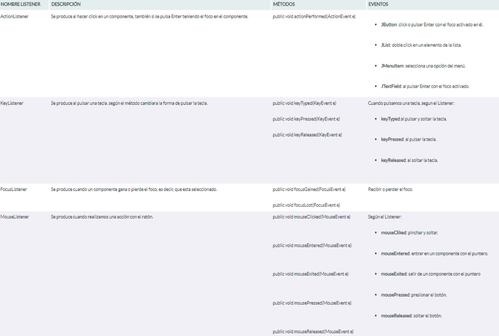
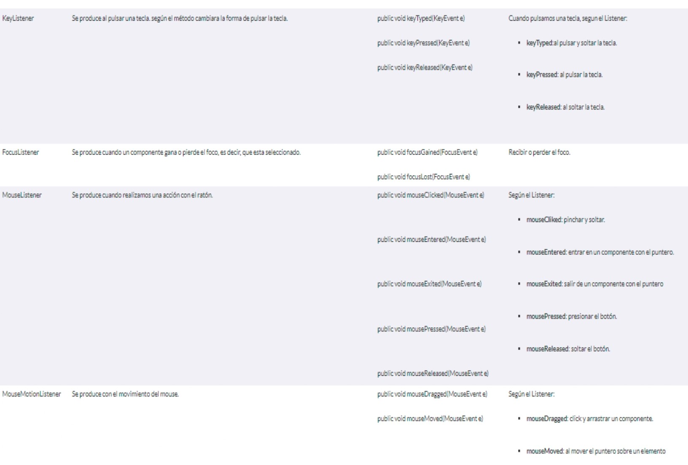

Juan Julio Barron Jimenez  
No.Control: 18100742

# 
 **INTERFACES Y METODOS LISTENER EN JAVA** 

## **Que es una interfaz en java?**
Las interfaces son una forma de especificar qué debe hacer una clase sin especificar el cómo.  

Las interfaces tienen una semejanza con las clases abastractas, en el sentido que no tiene sentido definir objetos instancia de una interfaz. Igual que las clases abstractas clase asociada se comprometa a implementar todos los métodos en ellas definidos, PERO en este caso la relacions no es de herencia en plenitud, dado que no hay atributos en la definición de una interfaz.  

Las interfaces no son clases, sólo especifican requerimientos para la clase que las implementa o, desde su uso, los servicios para la función que manipula un objeto que se dice cumplir con la interfaz.

## **DECLARACION DE UNA INTERFAZ**  
La declaración de una interfaz es similar a una clase, aunque emplea la palabra reservada interface en lugar de class y no incluye ni la declaración de variables de instancia ni la implementación del cuerpo de los métodos (sólo las cabeceras). La sintaxis de declaración de una interfaz es la siguiente:  

**public interface IdentificadorInterfaz**  
{  
    // Cuerpo de la interfaz ...  
}  

Una interfaz declarada como public debe ser definida en un archivo con el mismo nombre de la interfaz y con extensión .java. Las cabeceras de los métodos declarados en el cuerpo de la interfaz se separan entre sí por caracteres de punto y coma y todos son declarados implícitamente como public y abstract (se pueden omitir). Por su parte, todas las constantes incluidas en una interfaz se declaran implícitamente como public, static y final (también se pueden omitir) y es necesario inicializarlas en la misma sentencia de declaración.

### **Por ejemplo:** 
la interfaz Modificacion declara la cabecera de un único método:

/**  
  Declaracion de la interfaz Modificacion  
 */  
public interface Modificacion   
{  
    void incremento(int a);  
}  

que se almacena en el archivo fuente Modificacion.java y que, al compilarse:

$>javac Modificacion.java
genera un archivo Modificacion.class.  
Al no corresponder a una clase que implementa un método main, este archivo no puede ejecutarse con el intérprete de Java.

### **Segundo ejemplo:** 
la interfaz constantes declara dos constantes reales con el siguiente código fuente:

/**  
  Declaracion de la interfaz Constantes  
 */  

public interface Constantes  
{  
    double VALOR_MAXIMO = 10000000.0;  
    double VALOR_MINIMO = -0.01;  
}  
que se almacena en el archivo fuente Constantes.java y que, al compilarse, genera un archivo Constantes.class

### **Tercer ejemplo:**  

la interfaz Numerico declara una constante real y dos cabeceras de métodos con el siguiente código fuente:

/**  
  Declaracion de la interfaz Numerico  
 */  
public interface Numerico  
{  
    double EPSILON = 0.000001;  
    void establecePrecision(float p);  
    void estableceMaximo(float m);  
}  

que se almacena en el archivo fuente Numerico.java y que, al compilarse, genera un archivo Numerico.class.  

# 
 **METODOS EN JAVA** 
 

